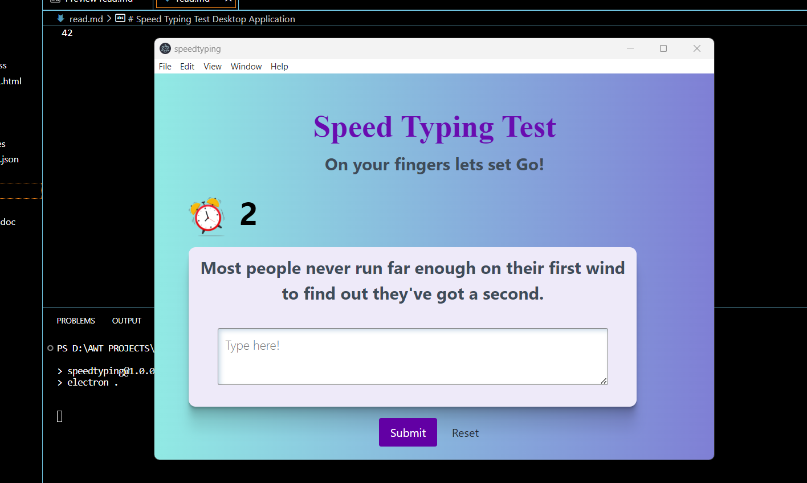

# Speed Typing Test Desktop Application

## Overview

Speed Typing Test is a desktop application developed to assess and improve typing speed and accuracy. It provides an interactive environment for users to practice and enhance their typing skills. The application fetches random quotes from an external API, and users are prompted to type the displayed quote within a specified time. This README guide will help you set up and run the application on your local machine.

## Prerequisites

Before you begin, make sure you have the following installed on your machine:

- [Node.js](https://nodejs.org/): Download and install Node.js, which includes npm (Node Package Manager).
- [Visual Studio Code](https://code.visualstudio.com/): Install VS Code, a lightweight and powerful code editor.

## Getting Started

1. **open vs code**


2. **Install Dependencies:**
   ```bash
   npm install
   ```

3. **Run the Application:**
   ```bash
   npm start
   ```

   This command will start the Electron application and open the Speed Typing Test on your desktop.

## Usage

- The application will fetch a random quote from the API.
- You can type the displayed quote in the input field.
- Click the "Submit" button to check your typing speed and accuracy.

## Additional Information

- The application uses Bootstrap for styling and the Fetch API to retrieve quotes.
- Unit testing and integration testing have been implemented to ensure the application's reliability.


